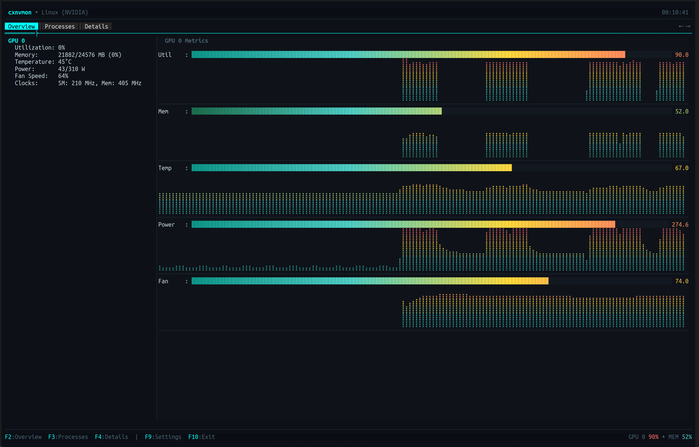
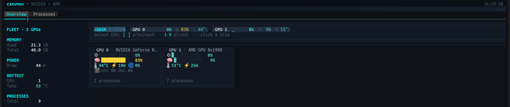
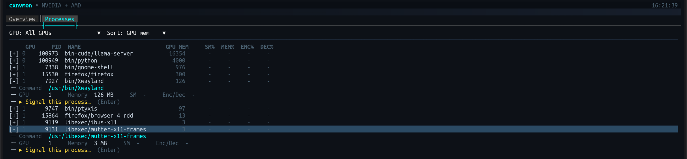

# cxgpu

<div align="center">

[](LICENSE)
[](https://dotnet.microsoft.com/)
[]()
[]()

</div>

**A multi-vendor GPU monitor for the terminal, built on [SharpConsoleUI](https://github.com/nickprotop/ConsoleEx).**

<div align="center">

### ⭐ If you find cxgpu useful, please consider giving it a star! ⭐

It helps others discover the project and motivates continued development.

[](https://github.com/nickprotop/cxgpu/stargazers)

</div>

Live gauges and braille sparkline history for utilization, memory, temperature, power and fan;
per-process GPU usage with signal actions; a fleet dashboard for multi-GPU boxes; and full device
details — for **NVIDIA and AMD**, side by side in the same view.

**Monitor your GPUs. Right in the terminal.**



## Quick Start

**Option 1: One-line install** (Linux, no .NET required)
```bash
curl -fsSL https://raw.githubusercontent.com/nickprotop/cxgpu/main/install.sh | bash
cxgpu
```

**Windows** (PowerShell)
```powershell
irm https://raw.githubusercontent.com/nickprotop/cxgpu/main/install.ps1 | iex
```

**Option 2: Build from source** (requires .NET 10)
```bash
git clone https://github.com/nickprotop/cxgpu.git
cd cxgpu
./build-and-install.sh
cxgpu
```

No GPU to hand? `cxgpu --demo` runs against simulated GPUs — useful for trying the multi-GPU
views on a single-GPU machine, or with no GPU driver at all.

## Supported hardware

cxgpu probes for each vendor at startup and shows whichever it finds — including both at once on a
hybrid machine. A vendor that isn't present is simply absent; nothing errors.

| Vendor | Source | Platform |
|---|---|---|
| **NVIDIA** | `nvidia-smi` | Linux, Windows |
| **AMD** | `sysfs` + `hwmon` + `/proc/*/fdinfo` | Linux |
| **AMD** | `amd-smi` / `rocm-smi` | Windows, or Linux without sysfs |

The AMD backend needs **no extra tooling and no root** on Linux — it reads the kernel directly, which
is both faster than a CLI and the only source that can attribute memory to individual processes.

> **Metrics differ by vendor, and cxgpu says so rather than guessing.** Each backend declares what
> it can measure, and anything it can't is **omitted** — never shown as a zero. An APU with no fan
> sensor shows no fan gauge; a source that can't attribute per-process usage says
> "not available" instead of "no processes".

## Views

### Overview — one GPU in depth

Gauges plus braille sparkline history for utilization, memory, temperature, power and fan, a
one-line vitals summary, encode/decode readouts, and a spec-sheet of the device: driver, PCIe link,
CUDA version, clocks, VRAM, limits, VBIOS, and which data source is live.

A **throttle chip** appears only when the GPU is genuinely throttling (`⚠ thermal`, `⚠ power cap`,
`⚠ hw slowdown`) — the benign "idle" bits every card reports are filtered out, so the chip means
something when you see it.

### Dashboard — the whole fleet at once

On a multi-GPU machine the summary strip gains a **`‹DASH›` chip**. Select it and the Overview
becomes a fleet view: aggregate totals on the left (combined VRAM, combined draw, hottest card,
total processes, anything throttling) and a hero panel per GPU on the right. Double-click a panel to
jump into that GPU's detail.



### Processes — who is using the GPU

An expandable tree of GPU processes with a toolbar to filter by GPU (or show **all GPUs** at once)
and sort by memory, SM%, PID or name. Expand a row for the full command path and live per-process
detail; from there you can send **SIGTERM** or **SIGKILL**, with a confirmation on the latter.



Outcomes are reported honestly: "permission denied — it belongs to another user" and "already
exited" are distinct messages, not a generic failure.

## Features

| | |
|---|---|
| 🖥️ **Multi-Vendor** | NVIDIA and AMD in one view, each through its own backend |
| 📊 **Overview** | Live gauges with braille sparkline history, vitals line, and a full device spec-sheet |
| 🧩 **Fleet Dashboard** | Per-GPU hero panels plus aggregate totals, on the `‹DASH›` chip |
| 📋 **Processes** | Expandable tree with GPU filter, sorting, per-process engine usage, and signal actions |
| ⚠️ **Throttle Detection** | Named throttle reasons surfaced only when a real throttle is active |
| 🎬 **Encode / Decode** | NVENC/NVDEC utilization where the hardware reports it |
| 🎯 **Capability-Aware** | Unsupported metrics are omitted, never faked as zero |
| 🎛️ **Settings** | A paged settings dialog (F9) — refresh, graphs, tabs, and per-backend options |
| ❓ **Help Overlay** | `?` or F1 lists every binding, marking those that don't apply on this machine |
| 📐 **Responsive** | Adapts to terminal width — side-by-side or stacked, wrapping panel grids |
| 🧪 **Demo Mode** | `--demo[=N]` simulates up to 9 GPUs for states real hardware won't produce on demand |

## Keyboard Shortcuts

| Key | Action |
|-----|--------|
| F2 / F3 | Overview / Processes tab |
| `[` `]` | Previous / next GPU tile (multi-GPU) |
| 1–9 | Select a GPU directly (multi-GPU) |
| → / Enter | Expand a process row (Processes) |
| ← | Collapse |
| `k` | Signal the selected process (Processes) |
| ? / F1 | Keyboard shortcuts |
| F9 | Settings |
| F10 / Esc | Exit |

Status-bar hints and GPU tiles are clickable; double-clicking a dashboard panel opens that GPU.

## Command Line

```
cxgpu [options]

  --demo[=N]      Run against N simulated GPUs (default 4, max 9) instead of
                  real hardware. Also settable via CXGPU_FAKE_GPUS=N.
  -h, --help      Show help and exit.
  -v, --version   Show the version and exit.
```

## Configuration

Settings live as JSON at the platform config location:

- **Linux:** `~/.config/cxgpu/config.json` (honours `XDG_CONFIG_HOME`)
- **Windows:** `%APPDATA%\cxgpu\config.json`

Edit them in-app with **F9**. The dialog is paged: refresh interval, graph options, tab visibility,
and a page per GPU backend where you can enable or disable that vendor and change its options — for
example which mechanism the AMD backend reads through. A disabled backend is never probed at all.

A missing or invalid file falls back to defaults, so the app always starts. Unrecognised keys are
preserved on save, so a config written by a newer build survives a downgrade.

## Architecture

GPU access sits behind one seam. Each vendor is a **backend** that declares its own capabilities and
settings, so adding a vendor doesn't touch the UI.

```
cxgpu/
├── Program.cs                    # Entry point, CLI parsing
├── Configuration/                # CxgpuConfig (JSON load/save)
├── Gpu/
│   ├── Abstractions/             # Models, IGpuBackend, capabilities, plugin settings
│   ├── GpuBackendRegistry.cs     # Probes backends, aggregates, assigns global GPU indices
│   ├── GpuBackendPlugin.cs       # Backends as SharpConsoleUI plugin services
│   ├── GpuStatsFactory.cs        # Backend selection and configuration
│   ├── ProcessSignals.cs         # SIGTERM/SIGKILL delivery
│   └── Backends/
│       ├── Nvidia/               # nvidia-smi
│       ├── Amd/                  # sysfs + hwmon + fdinfo, or amd-smi/rocm-smi
│       └── Demo/                 # Synthetic GPUs for --demo
├── Dashboard/                    # Main window, settings, help, busy indicator
├── Helpers/                      # UI constants, shared metric formatting, history
└── Tabs/                         # Overview (+ fleet dashboard), Processes
```

Backends implement SharpConsoleUI's `IPluginService`, so they are already valid plugins — the day the
framework gains runtime assembly loading, they become drop-in without a refactor.

## Building from Source

cxgpu uses a conditional project reference for [SharpConsoleUI](https://github.com/nickprotop/ConsoleEx):

- **Local development:** if ConsoleEx is cloned as a sibling directory (`../ConsoleEx`), the project
  reference is used automatically
- **CI/Release builds:** falls back to the SharpConsoleUI NuGet package

```bash
# Clone both repos as siblings
git clone https://github.com/nickprotop/ConsoleEx.git
git clone https://github.com/nickprotop/cxgpu.git

cd cxgpu
dotnet build cxgpu.csproj
```

**Key Technologies:** .NET 10, [SharpConsoleUI](https://github.com/nickprotop/ConsoleEx), `nvidia-smi`,
Linux `sysfs`/`hwmon`, `amd-smi`/`rocm-smi`

## Uninstall

**Linux/macOS:**
```bash
cxgpu-uninstall.sh
```

**Windows (PowerShell):**
```powershell
& "$env:LOCALAPPDATA\cxgpu\cxgpu-uninstall.ps1"
```

## License

MIT License. See [LICENSE](LICENSE) for details.
